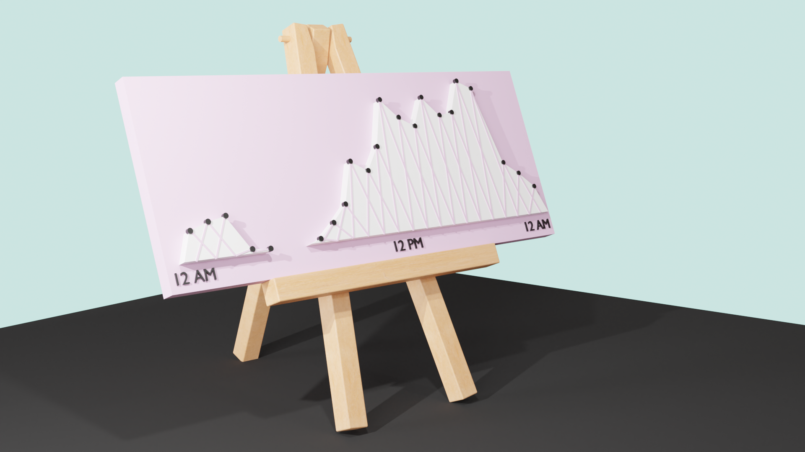
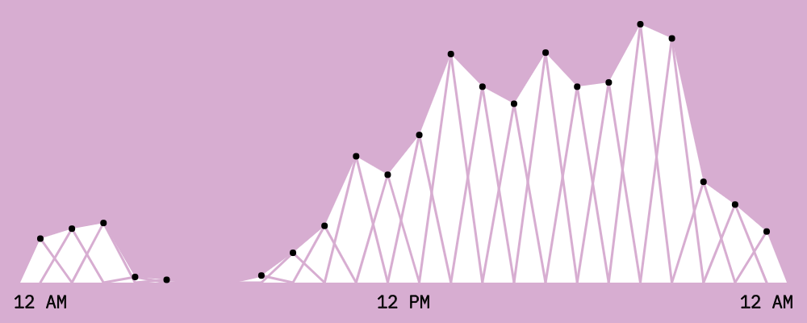
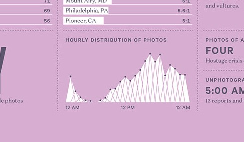

# Feltron graphs

<!--  -->

## This is my version made in P5js

## This is one of Feltrons graphs from his 2012 [annual report](http://feltron.com/FAR12.html)

I think it's funny how similar the actual shape of the graphs are, as this suggests the act of aggregating any natural behaviour per hour over a long time would create a similar graph. Such as when you pick up your phone, when you stand up, when you drink water, etc... Therefore these types of graphs are pretty boring, tell me one difference that my graph shows compared to Feltron's? I listen to slightly less songs at midnight than he takes photos, relative to our datasets??? However his graphs look amazing anyway. Which I guess is the point of these graphs, you get the general idea of the distribution and they just look good!

## my dataset

`data.csv` contains the songs I listened to for a few months, with their timestamp
